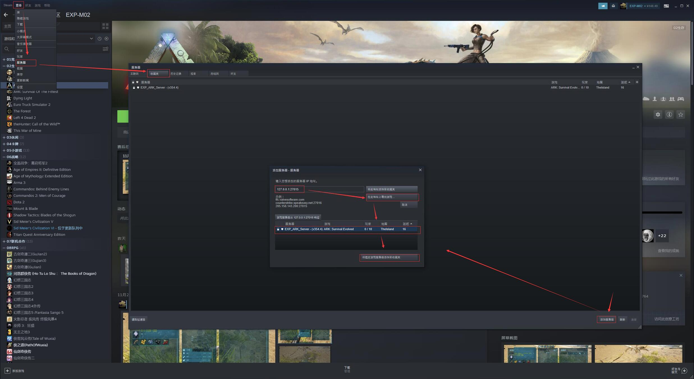
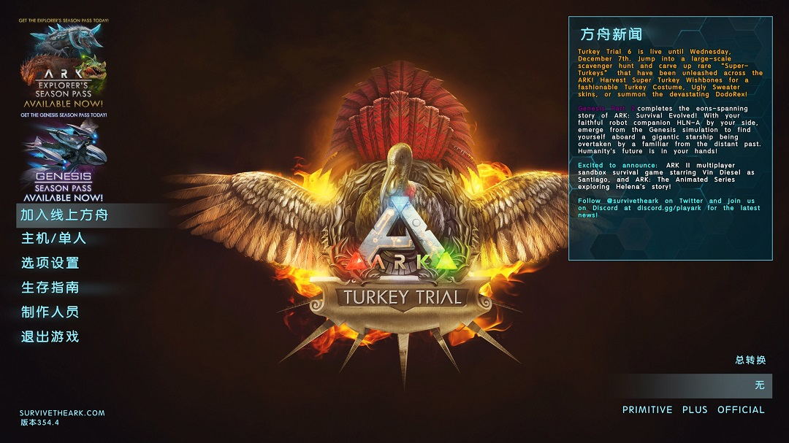
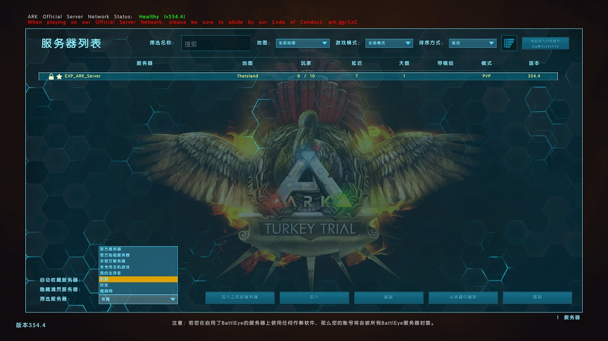
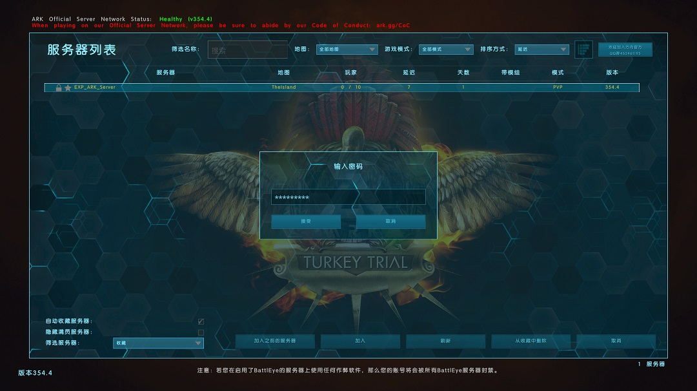
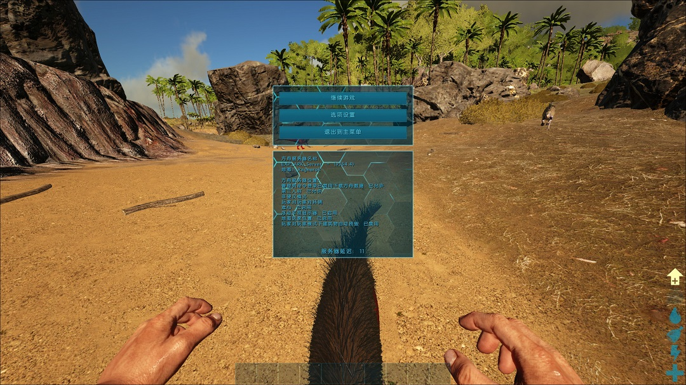

# ARK: Survival Evolved Dedicated Server

> ARK: 方舟‧生存进化 - steam 服务端

------

## 介绍

此为 steam 版 ARK 服务端 [354.4](./version.txt) 版本（20221129）。

与 [SteamCMD](https://developer.valvesoftware.com/wiki/SteamCMD) 下载的服务端是一样的，配合 [ark-server-docker](https://github.com/lyy289065406/ark-server-docker.git) 使用。

> 上传到 Github 是为了方便通过 [ssh](https://docs.github.com/en/authentication/connecting-to-github-with-ssh) 下载、以解决 steam 下载太慢或总是失败的问题

## 运行环境

 

## 硬件要求

| 硬件 | 最低配置 | 推荐配置 | 流畅配置 |
|:---:|:---:|:---:|:---:|
| CPU | 2C | 4C | 8C|
| 内存 | 6G | 8G | 16G |
| 虚拟内存 | 4G | 4G | 4G |
| 硬盘 | 30G | 50G | 100G |

> ARK 当前版本的服务端大小为 18812537984 bytes，约 18G

## 部署步骤

1. Frok 此仓库（目的是使用 [Github SSH](https://docs.github.com/en/authentication/connecting-to-github-with-ssh) 下载）: `https://github.com/lyy289065406/ark.git`
2. SSH 下载: `git clone --depth 1 --branch master git@github.com:${你的用户名}/ark.git`
3. 切换工作目录: `cd ark`
4. 解压大文件: `bin/unpack_7zip.sh` 或 `bin/unpack_7zip.ps1`（需要预装 [7-zip](https://www.7-zip.org/) 命令行）
5. 参考 [ARK Server configuration](https://ark.fandom.com/wiki/Server_configuration) 定制自己的启动脚本、启动服务即可

其中，启动服务所需的可执行文件：

- Linux: [ShooterGame/Binaries/Linux/ShooterGameServer](./ShooterGame/Binaries/Linux/ShooterGameServer)
- Windows: [ShooterGame/Binaries/Win64/ShooterGameServer.exe](./ShooterGame/Binaries/Win64/ShooterGameServer.exe)

服务启动后会自动生成：

- 配置目录: `ShooterGame/Saved/Config/*`
- 存档目录: `ShooterGame/Saved/SavedArks/*`
- 日志目录: `ShooterGame/Saved/Logs/*`

## 启动步骤

> 详见 [ark-server-docker](https://github.com/lyy289065406/ark-server-docker.git) 

## 关于 MOD

当前默认已安装的 MOD 如下，启动服务时按需选择开启即可：

| 订阅地址 | id | name | 用途 |
|:---:|:---:|:---|:---|
| [Link](https://steamcommunity.com/sharedfiles/filedetails/?id=2885013943) | 2885013943 | `ARK: Monster Additions!` | 添加【怪物猎人:世界】中出现的怪物 |
| [Link](https://steamcommunity.com/sharedfiles/filedetails/?id=1404697612) | 1404697612 | `Awesome SpyGlass!` | A+ 望远镜 |
| [Link](https://steamcommunity.com/sharedfiles/filedetails/?id=849372965) | 849372965 | `HG Stacking Mod 1000-90` | 物品叠加上限 `+1000` 负重 `-50%` |
| [Link](https://steamcommunity.com/sharedfiles/filedetails/?id=768023924) | 842913750 | `HG Stacking Mod 2500-50` | 物品叠加上限 `+2500` 负重 `-50%` |
| [Link](https://steamcommunity.com/sharedfiles/filedetails/?id=768023924) | 768023924 | `HG Stacking Mod 2500-90` | 物品叠加上限 `+2500` 负重 `-90%` |
| [Link](https://steamcommunity.com/sharedfiles/filedetails/?id=849985437) | 849985437 | `HG Stacking Mod 5000-90` | 物品叠加上限 `+5000` 负重 `-90%` |
| [Link](https://steamcommunity.com/sharedfiles/filedetails/?id=928102085) | 928102085 | `HG Stacking Mod 10000-90` | 物品叠加上限 `+10000` 负重 `-90%` |
